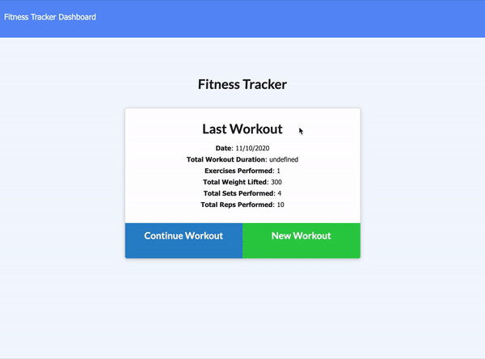

# Fitness-Tracker

## Description
This is a full stack project that creates a fitness tracker application using MongoDB for the database.

## Table of Contents
  1. [Installation](#Installation)
  2. [Usage](#Usage)
  3. [License](#License)
  4. [Contributing](#Contributing)
  5. [Questions](#Questions)

## Installation

No installations required. Visit the deployed application on Heroku: [Fitness Tracker](https://still-bayou-91018.herokuapp.com/)

## Usage

The user can log their exercises with this Fitness Tracker application. To log a new workout, the user can click on the *New Workout* button. To make edits to the last workout, the user can click on the *Continue Workout* button. To see all the past workouts, the user can click on *Dashboard* at the top of the webpage. 

## License

Other

## Contributing

Everyone is welcome to contribute. Please see [Questions](#Questions) below for the contact information.

## Questions

Please visit https://github.com/achueng to learn more about this project and the developer.
  
If there are any question, issues, or concerns, please contact Agnes via email at [agneschueng2020@u.northwestern.edu](mailto:agneschueng2020@u.northwestern.edu).
